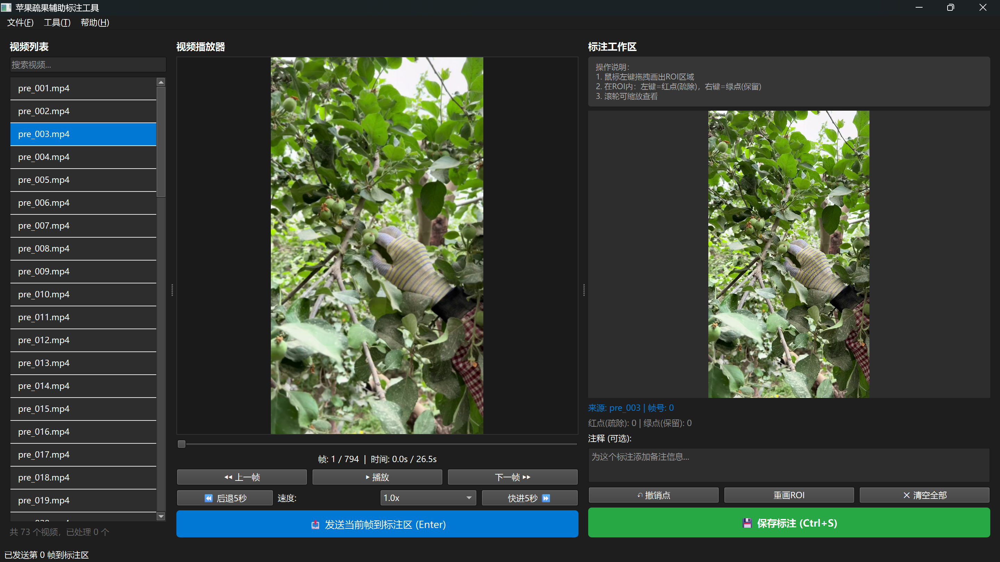

# VideoFrameLabeler: 视频抽帧与实例分割标注辅助工具
一个专为构建视觉感知数据集设计的半自动化标注桌面应用程序。它通过播放视频、手动抽帧
**核心价值**：将动态视频中的关键操作瞬间，快速、准确地转化为高质量的静态标注图像对，特别适用于农业操作、行为分析等需要从视频中提取结构化数据的场景。
## ✨ 功能特性
- **🎬 视频浏览与精准抽帧**：左侧面板支持视频列表加载、播放、倍速控制与逐帧进退，帮助您轻松定位到需要标注的关键帧。
- **⚡ 一键双保存**：保存时保存两份同名文件：
  - `./saved_images/Annotation/[frame].jpg`: 纯净的原始图像，用于后续标注。
  - `./saved_images/Reference/[frame].jpg`: 带有简单标记的参考图像，记录您的初步判断（如“保留”/“去除”），方便后续回顾。
- **📁 智能文件管理**：自动按视频源名为您管理生成的图像对，保持项目结构清晰。
## 🖥️ 界面预览
 
*(请在此处放置一张你的软件实际运行截图)*
*界面说明：左侧为视频控制区，右侧为当前帧显示与标注区。*
## 🚀 快速开始
### 前提条件
1.  **Python 3.10+**
2.  安装依赖库：我们强烈建议使用 [Conda](https://docs.conda.io/en/latest/) 或虚拟环境。

### 安装与运行

1.  **克隆仓库**
    ```bash
    git clone https://github.com/[你的GitHub用户名]/VideoFrameLabeler.git
    cd VideoFrameLabeler
    ```

2.  **安装依赖**
    ```bash
    pip install -r requirements.txt
    ```

3.  **运行应用**
    ```bash
    python main.py
    ```

### 使用流程
1.  启动``main.py``，程序会自动识别video文件下的所有视频
2.  在左侧列表选择视频，使用播放控制栏找到关键帧，点击发送到标注区
3.  在右侧预览图上，使用 **鼠标左键** 标记为“保留”类目标，**鼠标右键** 标记为“去除”类目标（此操作仅保存参考点，不进行分割）。
4.  点击 `保存标注` 按钮，保存当前帧的图像对。
5.  (可选)对于所有保存的 `[frame].jpg` 图像，使用 [SAM-Tool](https://github.com/zhouayi/SAM-Tool) 进行最终的实例分割标注。


## 🤝 如何贡献
没必要贡献，此项目为个人小工具，如需要新功能请自行fork

## 📄 许可证
无，随便用，当成你的python大作业都行

## 🙏 致谢
- 本工具的开发源于一项关于苹果自动化疏果的学术研究，旨在解决从真实农艺视频中高效构建数据集的难题。
- 感谢 [SAM-Tool](https://github.com/zhouayi/SAM-Tool) 提供了强大的基础标注能力。

- 感谢所有在研究和开发过程中提供建议的师长与同行。
